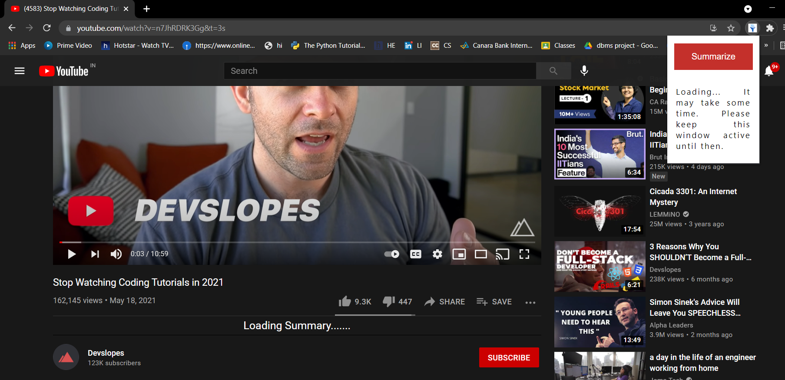
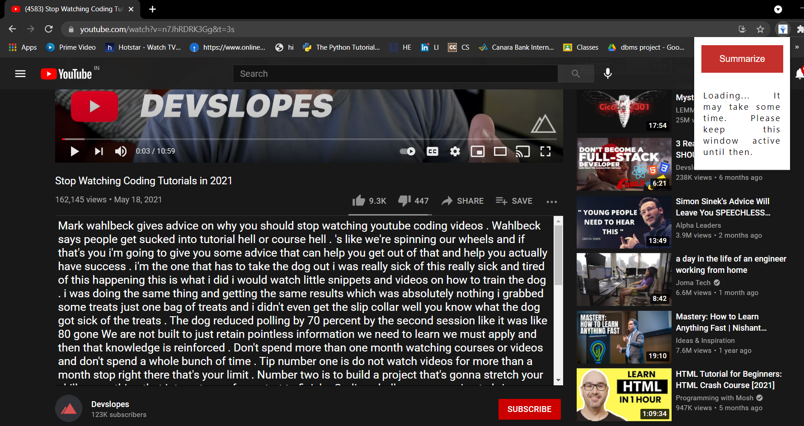

# YoutubeTranscriptSummarizer
A Chrome Extension which makes request to a backend REST API where it will perform NLP and respond with a summarized version of a YouTube transcript.

The project is divided into 2 parts:
1. ChromeExtension- A Chrome Extension which sends request to the backend.
2. youtubetranscriptsummarizer- server which process the request and sends it back to the client as a HTTP response.

### Installation:
1. Clone the repo.
2. Go in the youtubetranscriptsummarizer folder and create, activate a virtual environment and install the requirements
   with pip or pip3 install -r requirements.txt .
3. Make a account on [ngrok.com](https://ngrok.com/) and run the following cell with the auth token from [dashboard](https://dashboard.ngrok.com/get-started/setup)
    ```
    ! ngrok authtoken YOUR_AUTH_TOKEN
    from pyngrok import ngrok
    ngrok.kill()
    #LOCALHOST_PORT can be seen by first running the run and seeing the port in localhost  
    ngrok.connect(LOCALHOST_PORT)
    ```
4. Everything is done, run the app now. You can acess the website using the url provided above(change http to https in front of the url).
5. Also change the server link in [popup.js](/ChromeExtension/popup.js) file in get request to API.
6. Next load the chrome extension folder [ChromeExtension](/ChromeExtension) unpacked from [chrome://extensions/](chrome://extensions/).
   Go to [youtube](https://youtube.com/) and open a video and click on summarize and see the summary.
7. connect to ngrok each time app is run a new time.

### Improvements:
1. Presently, only basic setup is done. Exception handling is left, if the url is not correct. 
   This would not happen when using chrome extension but if used independently then it can occur.
   Some expections: The video is live, url is not correct.
2. Summarization needs to improved, if the content can be broken in some parts 
   and then summarization is done and that is given as time stamps.
   Sumy can be used.
3. The transcript is presently working only for youtube videos having captions on, the audio and text processing are left.
4. There can be extra features of choosing language and length of summary. There can be option to convert the text 
   to audio . 
5. The summary of some 10-15 minutes as time stamps can be given, then a person can also search for a keyword, when it
   is discussed and can go directly to that time 
   
   



 
